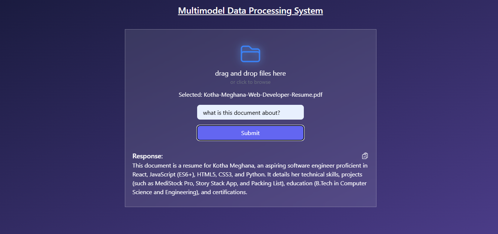

# Multimodel data processing system

## Description
Multimodel data processing system is a web-base application that allows users to upload documents [PDF, DOCX,TXT] or images [png, jpg etc] and interact with them using natural language queries. Once a document is uploaded, the AI read its content and provides accurate, context-aware answers to user questions.

The app integrates Google’s Generative AI (Gemini API) to generate intelligent responses based on the document’s content. It features a responsive, user-friendly interface with typing animations for AI responses, the ability to copy answers to the clipboard, and regenerate responses when needed.

This project is built entirely on the frontend using React, making it easy to deploy and use without a backend server. It’s ideal for users who want quick insights from their documents without manually reading through them.

## Key Highlights:
1. Supports multiple document formats
2. Generate answers using AI in real-time
3. Fully Frontend-based; no backend required

## Usage
1. Open the app in your browser.
2. Upload a document or image.
3. Type your question in input box.
4. Click "Submit" to get AI-generated answers.

## Screenshots

## Technologies Used
- React
- Tailwind CSS
- Google Generative AI [ Gemini API ]
- react-type-animation
- react icons

## Live Demo
Check out the live project here; [Project Link](https://kothameghana510.github.io/Multimodel-data-processing-system/)